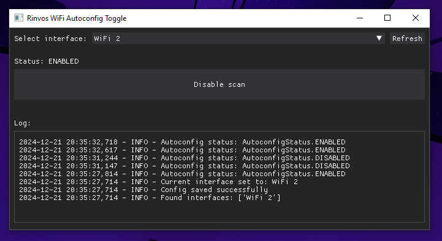

# Rinvos WiFi Autoconfig Toggle
If you run your VR headeset wirelessly using WIFI Hotspot you definitely have noticed that every 15-30 seconds it starts to stutter terribly - this happens because by default windows runs scan for wifi networks every 15-30 seconds and during this scan performance of the hotspot drops a lot, resulting
in stutters, lag, artifacting, etc. Annoying stuff. 

I struggled to fix this issue particularly because there was no simple-to-use app that would just do it for me. 
Well, this is an attempt creating such app.

This app is a simple user interface allowing you to select your wifi interface out of the dropdown and toggle scan on and off for it. 



#### How to use:
- Run program (get executable in releases tab or build it from source)
- Start your wifi hotspot
- Disable wifi scan in the program
- Play wireless vr without regular stutters
- Whenever you need wifi scan back - enable it in the program

#### warnings
- program requires administrator previliges and will propmpt you when you try to change scan status
- program changes scan status by running commands in the console window, so it might flash on your screen for a moment

> NEVER run software with admin privileges on a computer unless you trust it and its source! You can review entire code of this program in this repository if you feel like doing it. (improvements will also be welcome)


-----
## If you want to run it from source code or build executable yourself


#### Prerequisites
Ensure you have the following installed:
- Python 3.8 or newer
- [pip](https://pip.pypa.io/en/stable/)
- `pyinstaller` (if you plan to build an executable)

#### Getting the repository
1. Clone the repository:
   ```bash
   git clone https://github.com/yourusername/rinvos-wifi-autoconfig-toggle.git
   cd rinvos-wifi-autoconfig-toggle
   ```

2. Install the required Python packages:
   ```bash
   pip install -r requirements.txt
   ```

3. Run the application:
   ```bash
   python main.py
   ```


#### Building an Executable
To package the application into an executable:
1. Install `pyinstaller`:
   ```bash
   pip install pyinstaller
   ```
2. Create the executable (`--debug` option helps with antivirus anger issues):
   ```bash
   pyinstaller --icon=assets/icon.ico --noconsole --onefile --debug all main.py
   ```
3. The resulting executable will be in the `dist/` folder.


#### Dependencies
This project depends on the following Python packages:
- dearpygui
- pywin32
- logging

#### Contributing
1. Fork the project.
2. Create a new branch: `git checkout -b feature-name`.
3. Make your changes and commit: `git commit -m 'Add some feature'`.
4. Push to the branch: `git push origin feature-name`.
5. Submit a pull request.

#### License

This project is licensed under the MIT License. See `LICENSE` for details.

---

## Troubleshooting

- **Executable Flagged as Virus**: This is often a false positive when using `pyinstaller`. See the [PyInstaller FAQ](https://pyinstaller.org/en/stable/faq.html) for solutions.

